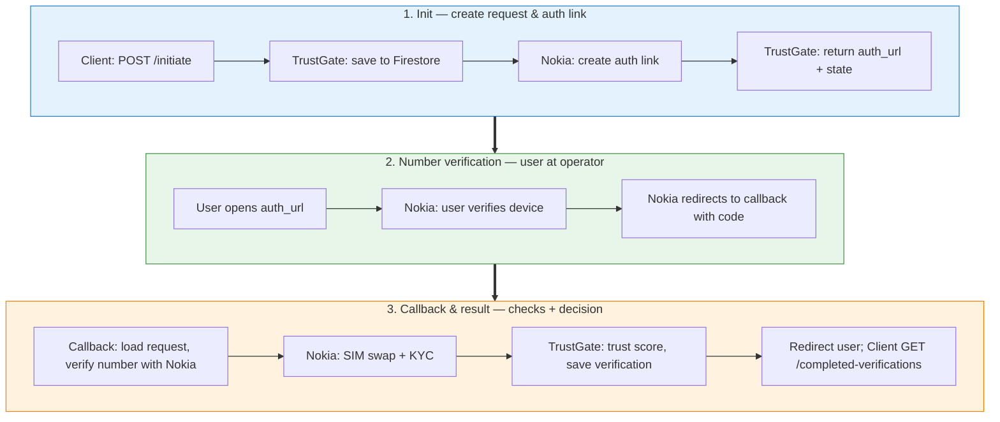
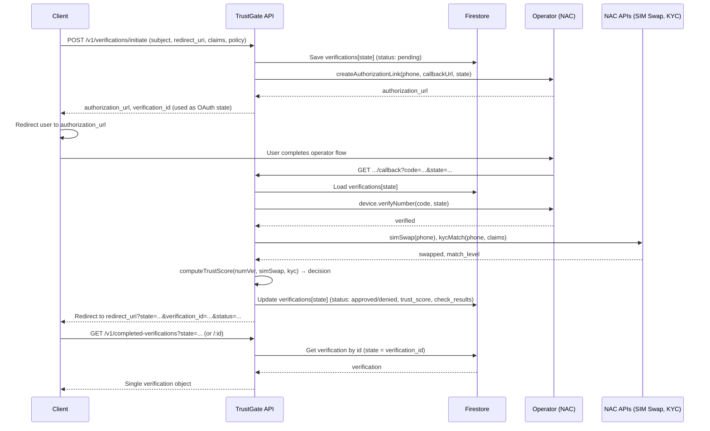
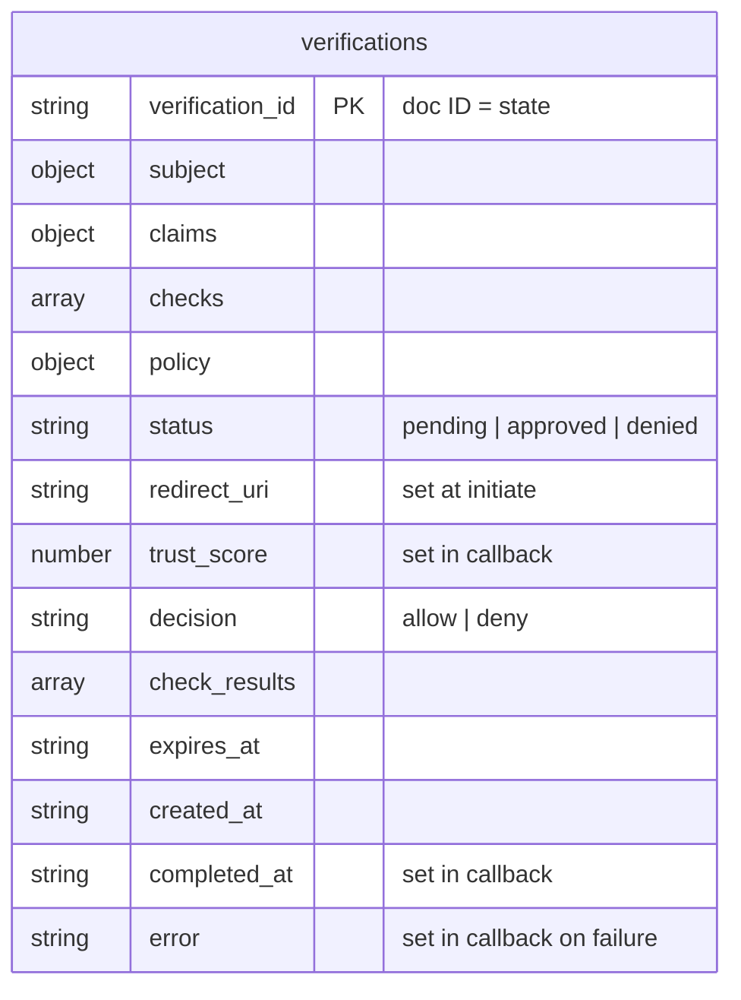
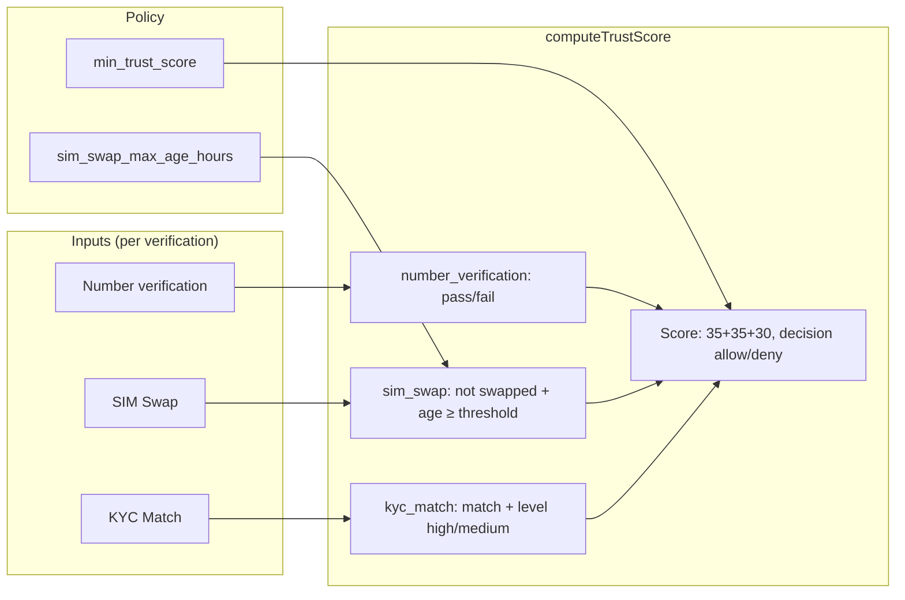

# TrustGate — Architecture (Technical Pitch)

TrustGate is an identity verification solution that uses **telecom network data** (CAMARA / Nokia Network as Code) instead of document uploads. One verification request at a time: **initiate** → user completes operator redirect → **callback** runs all checks and persists one **completed verification**; clients query by ID.

---

## High-level architecture

One verification flow in three phases. **Platform** = your app + TrustGate + Firestore. **Nokia** = Network as Code (operator auth, SIM swap, KYC). Eyes follow top → down; phases are color-coded.

**Platform vs Nokia:** In **Init**, TrustGate calls Nokia to obtain the `authorization_url`. In **Number verification**, the user interacts only with Nokia; Nokia then redirects to TrustGate. In **Callback & result**, TrustGate calls Nokia for number verification, SIM swap, and KYC, then decides and persists the result.

**Deployment:** TrustGate runs as a single Next.js app on **Firebase App Hosting** (Cloud Run + CDN). Firestore holds request state and completed verifications. No document storage; no separate backend service.

---

## Verification flow (sequence)

---

## Data model

A single **verifications** collection holds the full lifecycle. Document ID = `verification_id` = `state` (the value returned from initiate).

- **verifications:** One document per verification. Created at **initiate** with `status: "pending"` and `redirect_uri`. The **callback** loads by `state` (doc ID), runs number verification + SIM swap + KYC, then updates the same document to `status: "approved"` or `"denied"` with `trust_score`, `decision`, `check_results`, and `completed_at`. Queried by `verification_id` (same as state).

---

## Trust score and CAMARA checks

| Check | Weight | Pass condition |
|-------|--------|----------------|
| Number verification | 35 | Device verified via operator redirect |
| SIM Swap | 35 | No recent swap (configurable max age in hours) |
| KYC Match | 30 (or 15 if match but low level) | Identity claims match operator data (level high/medium) |

**Decision:** `allow` if total score ≥ `min_trust_score` (default 75); otherwise `deny`.

---

## Component map

| Layer | Components |
|-------|------------|
| **API** | `POST /v1/verifications/initiate`, `GET .../number-verification/callback`, `GET /v1/completed-verifications?state=`, `GET /v1/completed-verifications/:id` |
| **Lib** | `nac` (Nokia SDK: number verification, SIM swap, KYC), `trust-score` (score + decision), `firestore` (verifications: save, get, update) |
| **Storage** | Firestore: `verifications` (single collection; status pending → approved/denied in callback) |
| **External** | Nokia Network as Code (RapidAPI): authorization + number verification, SIM swap, KYC match |
| **Hosting** | Firebase App Hosting (Next.js on Cloud Run), Firestore |

---

## How to use this for a pitch

1. **High-level diagram** — Show client, TrustGate, Firebase, and NAC; emphasize “one app, one verification at a time, query by ID.”
2. **Sequence diagram** — Walk through: initiate → auth link → user at operator → callback runs all three CAMARA checks → trust score → one saved verification → client fetches by state or id.
3. **Data model** — Single verifications collection; document ID = verification_id = state; status moves from pending to approved/denied in the callback; no list, only single-verification lookup.
4. **Trust score** — Show the three checks and how the policy drives allow/deny.

Mermaid renders in GitHub, GitLab, and many doc tools; you can also export to PNG/SVG via [Mermaid Live](https://mermaid.live) or your IDE for slides.
