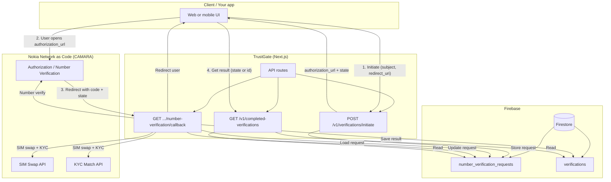
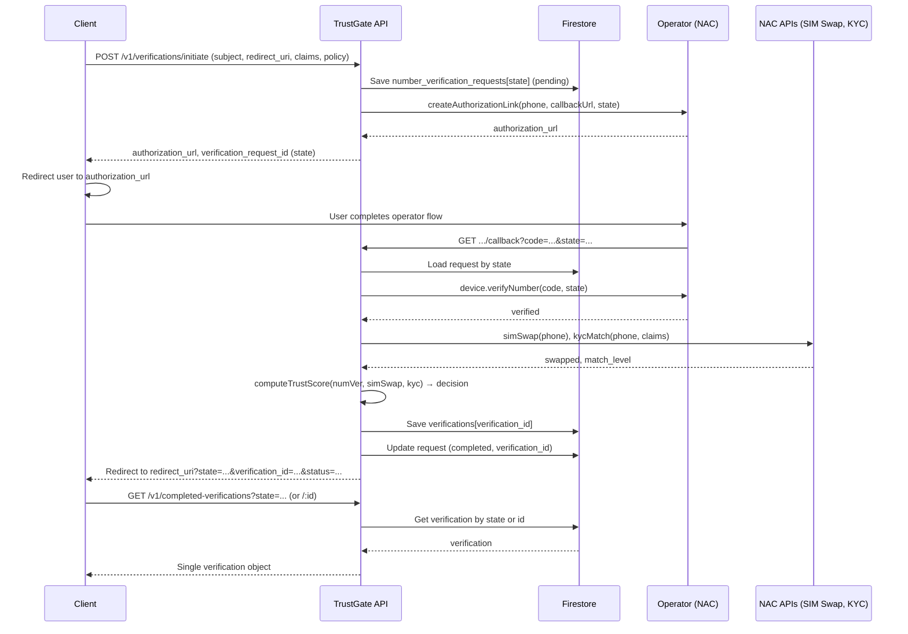
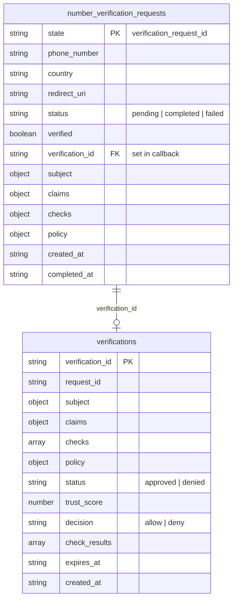
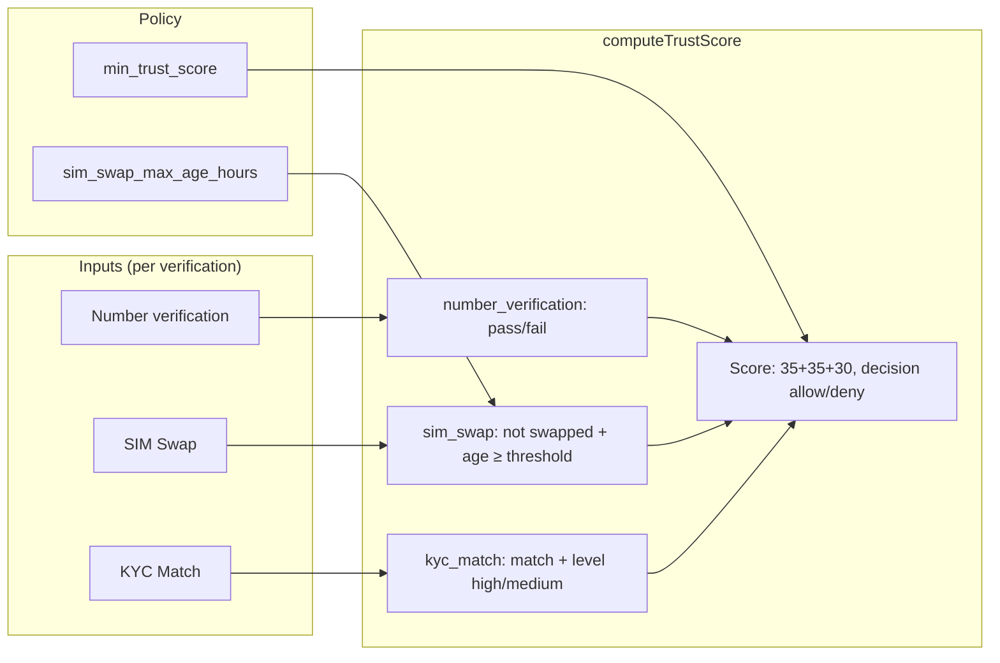

# TrustGate — Architecture (Technical Pitch)

TrustGate is an identity verification solution that uses **telecom network data** (CAMARA / Nokia Network as Code) instead of document uploads. One verification request at a time: **initiate** → user completes operator redirect → **callback** runs all checks and persists one **completed verification**; clients query by ID.

---

## High-level architecture

**Deployment:** TrustGate runs as a single Next.js app on **Firebase App Hosting** (Cloud Run + CDN). Firestore holds request state and completed verifications. No document storage; no separate backend service.

---

## Verification flow (sequence)

---

## Data model

- **number_verification_requests:** One document per initiated verification (key = `state`). Stores full request so the callback can run SIM swap + KYC after number verification. Updated to `completed` / `failed` and linked to `verification_id` when the callback finishes.
- **verifications:** One document per completed verification (key = `verification_id`). Written only by the callback. Queried by `state` (via request) or by `verification_id`.

---

## Trust score and CAMARA checks

| Check | Weight | Pass condition |
|-------|--------|----------------|
| Number verification | 35 | Device verified via operator redirect |
| SIM Swap | 35 | No recent swap (configurable max age in hours) |
| KYC Match | 30 (or 15 if match but low level) | Identity claims match operator data (level high/medium) |

**Decision:** `allow` if total score ≥ `min_trust_score` (default 75); otherwise `deny`.

---

## Component map

| Layer | Components |
|-------|------------|
| **API** | `POST /v1/verifications/initiate`, `GET .../number-verification/callback`, `GET /v1/completed-verifications?state=`, `GET /v1/completed-verifications/:id` |
| **Lib** | `nac` (Nokia SDK: number verification, SIM swap, KYC), `trust-score` (score + decision), `firestore` (requests + verifications) |
| **Storage** | Firestore: `number_verification_requests`, `verifications` |
| **External** | Nokia Network as Code (RapidAPI): authorization + number verification, SIM swap, KYC match |
| **Hosting** | Firebase App Hosting (Next.js on Cloud Run), Firestore |

---

## How to use this for a pitch

1. **High-level diagram** — Show client, TrustGate, Firebase, and NAC; emphasize “one app, one verification at a time, query by ID.”
2. **Sequence diagram** — Walk through: initiate → auth link → user at operator → callback runs all three CAMARA checks → trust score → one saved verification → client fetches by state or id.
3. **Data model** — Explain request table (by state) vs completed verification table (by verification_id); no list, only single-verification lookup.
4. **Trust score** — Show the three checks and how the policy drives allow/deny.

Mermaid renders in GitHub, GitLab, and many doc tools; you can also export to PNG/SVG via [Mermaid Live](https://mermaid.live) or your IDE for slides.
